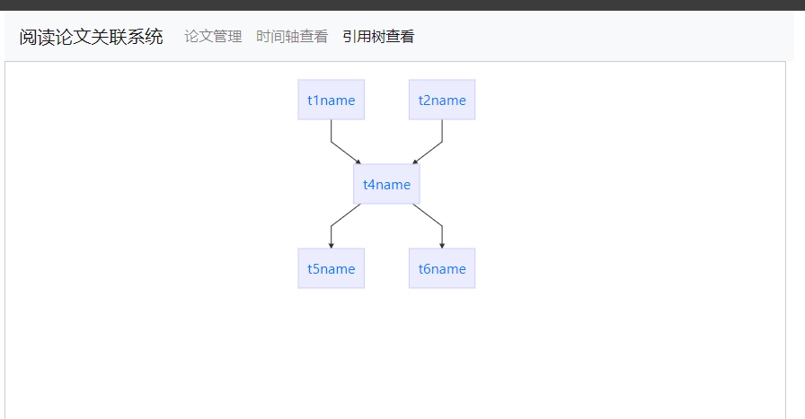
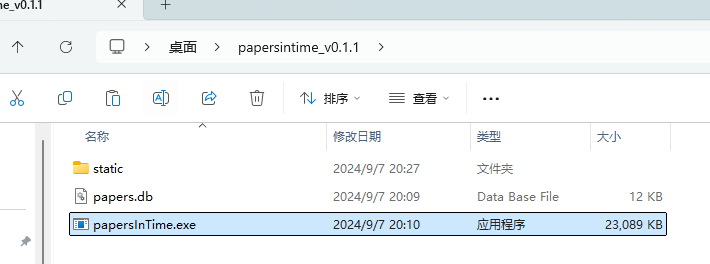
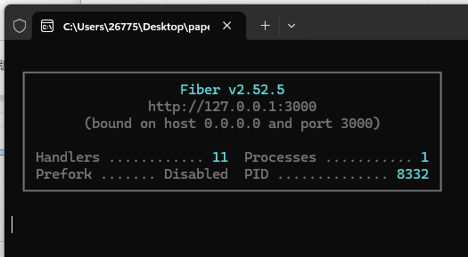
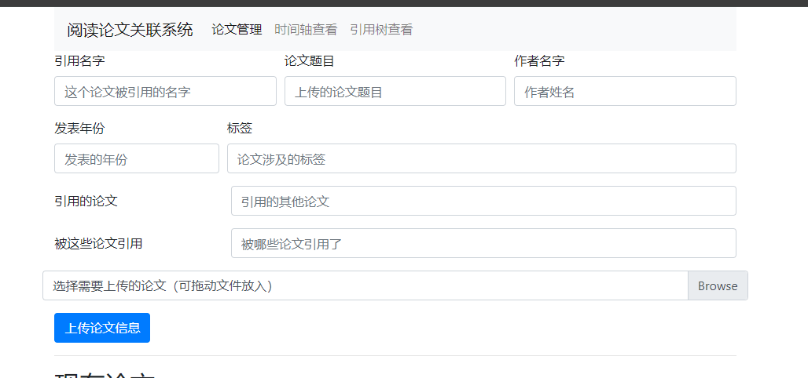
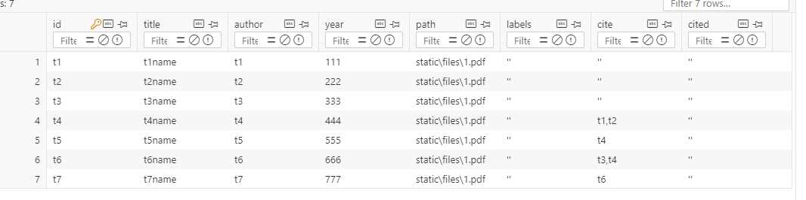

# 从时间线管理论文
可以使用类似于单向图的结构，从引用关系上查看自己看过的论文。如图所示:


# 运行
从release中下载最新版的zip压缩包并解压。

双击exe运行

在浏览器打开地址:

http://127.0.0.1:3000

# 上传论文
在主页就是上传论文的页面

## 关键词介绍
### 引用名字
这个地方就是这条记录的唯一主键，但是建议大家使用论文引用名字管理。

以soft actor critic为例，它的引用是：
```
@misc{haarnoja2018softactorcriticoffpolicymaximum,
      title={Soft Actor-Critic: Off-Policy Maximum Entropy Deep Reinforcement Learning with a Stochastic Actor}, 
      author={Tuomas Haarnoja and Aurick Zhou and Pieter Abbeel and Sergey Levine},
      year={2018},
      eprint={1801.01290},
      archivePrefix={arXiv},
      primaryClass={cs.LG},
      url={https://arxiv.org/abs/1801.01290}, 
}
```
我就建议使用**haarnoja2018softactorcriticoffpolicymaximum**作为其引用名字，这样更规范，以后也更好找。
### 论文题目
略
### 作者名字
略
### 发表年份
尽量填到年月吧
### 标签
你对其添加的标签，多个以`,`隔开
### 引用的论文
这篇论文都引用了哪些已经存在于数据库中的论文？多个以`,`隔开。
### 被这些论文引用
哪些已经存在于数据库中的论文引用了这篇论文？多个以`,`隔开。

这个可以不填，在描绘引用图的时候，会自动反向查找。
### 文件框
点击选择其对应的论文，可以拖动进入。选择之后不会明确显示选中的哪一篇，但是确实选中了，这里是一个bug，后期修复
# 示例
以这些引用结构为例子:

数据库是这样的：
